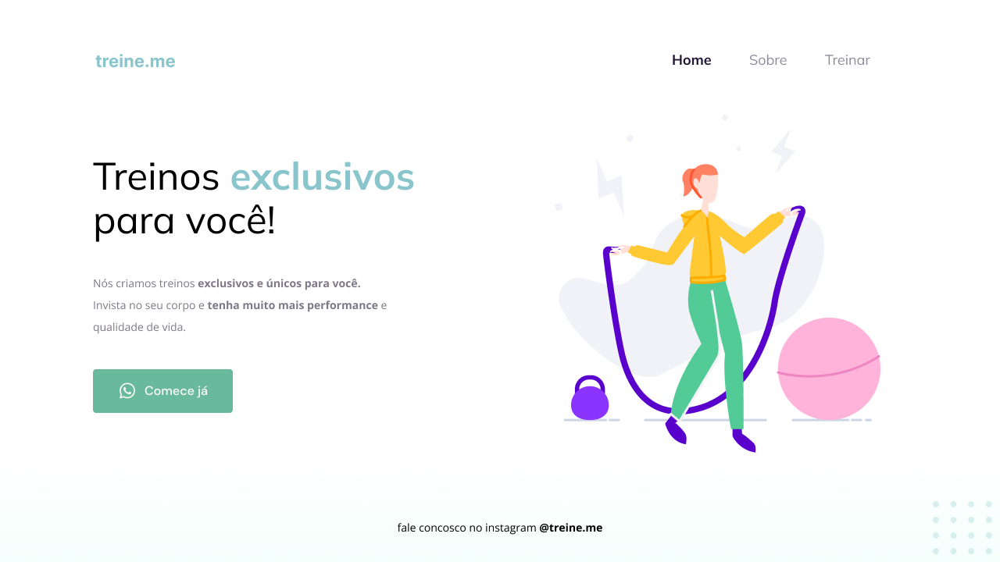

<h1 align="center"> Treine.me </h1>

Treine.me é um site desenvolvido como projeto para o ensino de tecnologias WEB da Rocketseat.  

  <a href="#-tecnologias">Tecnologias</a>&nbsp;&nbsp;&nbsp;|&nbsp;&nbsp;&nbsp;
  <a href="#-projeto">Projeto</a>&nbsp;&nbsp;&nbsp;|&nbsp;&nbsp;&nbsp;
  <a href="#-layout">Layout</a>&nbsp;&nbsp;&nbsp;|&nbsp;&nbsp;&nbsp;
  <a href="#memo-licença">Licença</a>f

  

 

  

## 🚀 Tecnologias

Esse projeto foi desenvolvido com as seguintes tecnologias:

- HTML e CSS
- Git e Github
- Figma

## 💻 Projeto

O Treine.me é o projeto de site de academia para desenvolver habilidades na programação WEB.

- [Visite o projeto online](https://alexsandro-oliveira.github.io/treine.me/)

## 🔖 Layout

Você pode visualizar o layout do projeto através [DESSE LINK](https://www.figma.com/file/JvSl11YDbU2jGyCALoa7Ib/Explorer---Projeto-treine.me?node-id=0%3A1&t=cPgRUAE8bq9lCGeS-1). É necessário ter conta no [Figma](https://figma.com) para acessá-lo.

## :memo: Licença

Esse projeto está sob a licença MIT.

---

Feito com ♥ by Alexsandro :wave:
